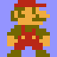
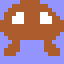
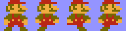
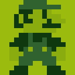
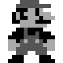
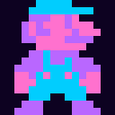

# Mario Animation

A collection of pixel art animation projects featuring Mario sprites in both Python and Go.


## Projects

### Python Implementations

#### 1. `python/mario_pygame.py` - Simple Mario Display
Simple Mario sprite display using Pygame.

**Run:**
```bash
pip install pygame
python python/mario_pygame.py
```

**Controls:**
- **ESC** - Quit

---

#### 2. `python/pixel_art_engine.py` - Full Pixel Art Engine
Full-featured pixel art engine with animated sprites (Mario walking animation and Goomba).

**Run:**
```bash
pip install pygame
python python/pixel_art_engine.py
```

**Controls:**
- **ESC** - Quit
- **S** - Save screenshot

**Features:**
- Animated walking sprites
- Sprite sheet generation
- PNG export functionality

**Output:**




---

#### 3. `python/pixel_art_manim.py` - Manim Animation
Manim-based animation that generates the GIF above.

**Run:**
```bash
pip install manim
manim -pql python/pixel_art_manim.py
```

---

### Go Implementations

#### 1. `go/main.go` - Full Ebitengine Game
Interactive pixel art viewer with:
- 4 color palettes (NES, Game Boy, Grayscale, Synthwave)
- Walking animation
- Wave distortion effect
- Screenshot export (PNG)
- Animation export (GIF)

**Run:**
```bash
cd go
go mod init pixelart
go get github.com/hajimehoshi/ebiten/v2
go run main.go
```

**Controls:**
| Key | Action |
|-----|--------|
| 1-4 | Switch palettes |
| SPACE | Toggle animation |
| W | Toggle wave effect |
| S | Save PNG |
| G | Save GIF |
| ESC | Quit |

---

#### 2. `go/headless.go` - Pure Go PNG Generator
No dependencies except standard library. Generates PNGs without a display.

**Run:**
```bash
cd go
go run headless.go
```

**Output:**






---

### Processing / p5.js Implementations

#### 1. `processing/pixel_art_demo.pde` - Processing Demo
Interactive pixel art viewer with Processing (Java-based visual arts language).

**Features:**
- 4 color palettes (NES, Game Boy, Grayscale, Synthwave)
- Walking animation
- Wave distortion effect
- Rotation effect
- Screenshot export

**Run:**
1. Download Processing from https://processing.org/download/
2. Open Processing IDE
3. Open `processing/pixel_art_demo.pde`
4. Click Play (or press Ctrl+R / Cmd+R)

**Controls:**
| Key | Action |
|-----|--------|
| 1-4 | Switch palettes |
| SPACE | Toggle animation |
| W | Toggle wave effect |
| R | Toggle rotation |
| S | Save screenshot |
| ESC | Quit |

---

#### 2. `processing/p5js_pixel_art.html` - p5.js Web Version
Browser-based pixel art viewer using p5.js (JavaScript).

**Features:**
- 4 color palettes
- Walking animation
- Wave distortion effect
- Runs in any modern browser
- No installation required

**Run:**
Simply open `processing/p5js_pixel_art.html` in your web browser.

**Controls:**
| Key | Action |
|-----|--------|
| 1-4 | Switch palettes |
| SPACE | Toggle animation |
| W | Toggle wave effect |

---

## Features

- 16x16 pixel art sprites
- NES-style color palette
- Animated walking sprites
- Sprite sheet generation
- PNG/GIF export functionality
- Multiple language implementations (Python, Go, Processing, p5.js)

## Why Ebitengine?

| Feature | Ebitengine |
|---------|------------|
| Language | Pure Go |
| Platforms | Windows, Mac, Linux, Web (WASM), Mobile, Switch |
| Performance | GPU-accelerated |
| API | Dead simple (3 methods) |
| Community | Active, used in commercial games |

Games made with Ebitengine:
- Bear's Restaurant
- Fishing Paradiso (2M+ downloads)
- OpenDiablo2

## Links

- Ebitengine: https://ebitengine.org/
- GitHub: https://github.com/hajimehoshi/ebiten
- Examples: https://ebitengine.org/en/examples/
